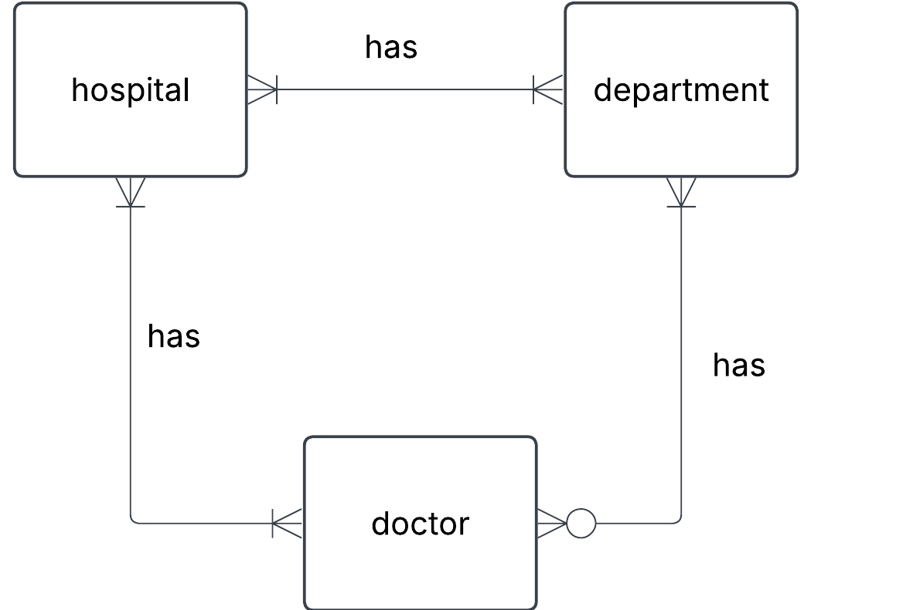
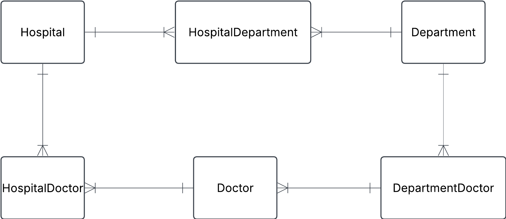

# Exercise 1

```
{
    "departments": [
    {
      "name": "Kardiologi",
      "doctors": [
        { "id": 1, "name": "Dr. Abra Abrahamson" },
        { "id": 2, "name": "Dr. Erika Eriksson" }
      ]
    },
    {
      "name": "Neurologi",
      "doctors": [{ "id": 3, "name": "Dr. Sven Svensson" }]
    }
  ]
}
```

Approach

- identify entitiies
- identify relationshps and cardinalities
- create conceptual ERD
- create tables

**Initial naive conceptual ERD**



**Initial table**

Hospital
|hospital_id|name|address|
|--|--|--|
|1|Sjukhusstock|Drottninggatan 3|

Department
|department_id|name|
|--|--|
|1|Kardiologi|
|2|Neurologi|

Doctor
|doctor_id|name|
|--|--|
|1|Dr. Abra Abrahamson|
|2|Dr. Erika Eriksson|
|3|Dr. Sven Svensson|

# Exercise 0

## 1. Hospital task

### Solution



HospitalDepartment
|hospital_department_id|hospital_id|department_id|
|--|--|--|
|1|1|1|
|2|1|2|

HospitalDoctor
|hospital_doctor_id|hospital_id|doctor_id|
|--|--|--|
|1|1|1|
|2|1|2|
|3|1|3|

DepartmentDoctor
|department_doctor_id|department_id|doctor_id|
|--|--|--|
|1|1|1|
|2|1|2|
|3|2|3|

Test a join
Want infomration on Sjukhusstock and its departments
- hospital_department can join with department_id on department table and hospital_id on hospital_table
- query name from hospital table and name from department table.
TODO: left for reader: create this SQL query.

----
**Solution**

```
SELECT h.name, d.name
FROM hospital as h
LEFT JOIN hospital_department as hd
ON h.id = hd.hospital_id
LEFT JOIN department as d
on d.id = hd.department_id;

```