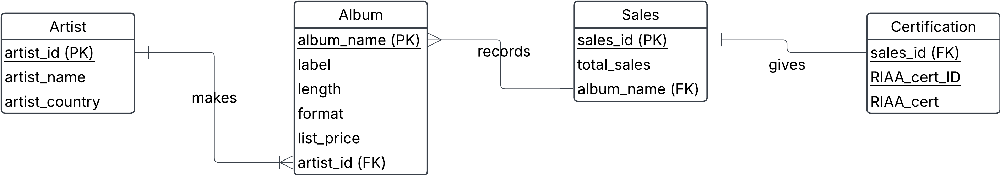

# Mob database design

**0. Album**

a) Find out problems with this table

- No clear ID, business knowledge required to know album is unique
- Insertion anomoly will introduce NULL values if adding data with, for instance, no certificate. Would be better to separate the certificates.
- Abbe Road Album is categorised worng. Should be Diamond

b) Normalize this table into 3NF

**Check for 1NF**

- row order doesn’t matter &#x2611;
- primary key in each table &#x2611;
    - Only problem might be the Album
- no repeating groups &#x2611;
- uniform column data &#x2611;

**Check for 2NF**
- 1NF
- non-prime attributes must be
functionally dependent on
entire primary key and not just
part of it

_Functionally dependent on Album?_
- Artist &#x2611;
- Artist Country &#x2612;
- Label &#x2611;
- Lenght &#x2611;
- Format &#x2611;
- Certified Sales &#x2611;
- RIAA Certification &#x2612;
- RIAA Cert. ID &#x2612;

Not 2NF, therefore we go to conceptual and logical modelling to model it out 

**Logical model which is 3NF**

