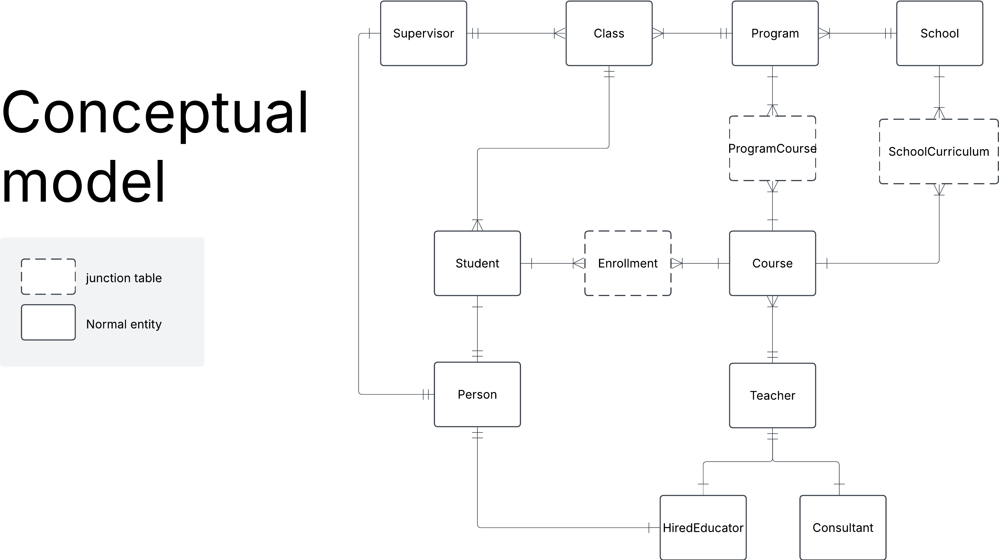
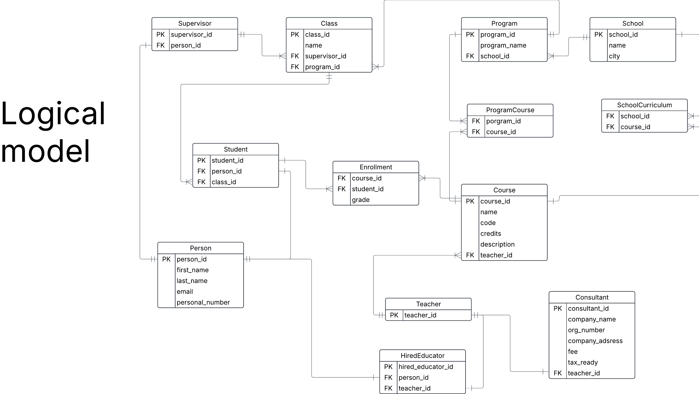
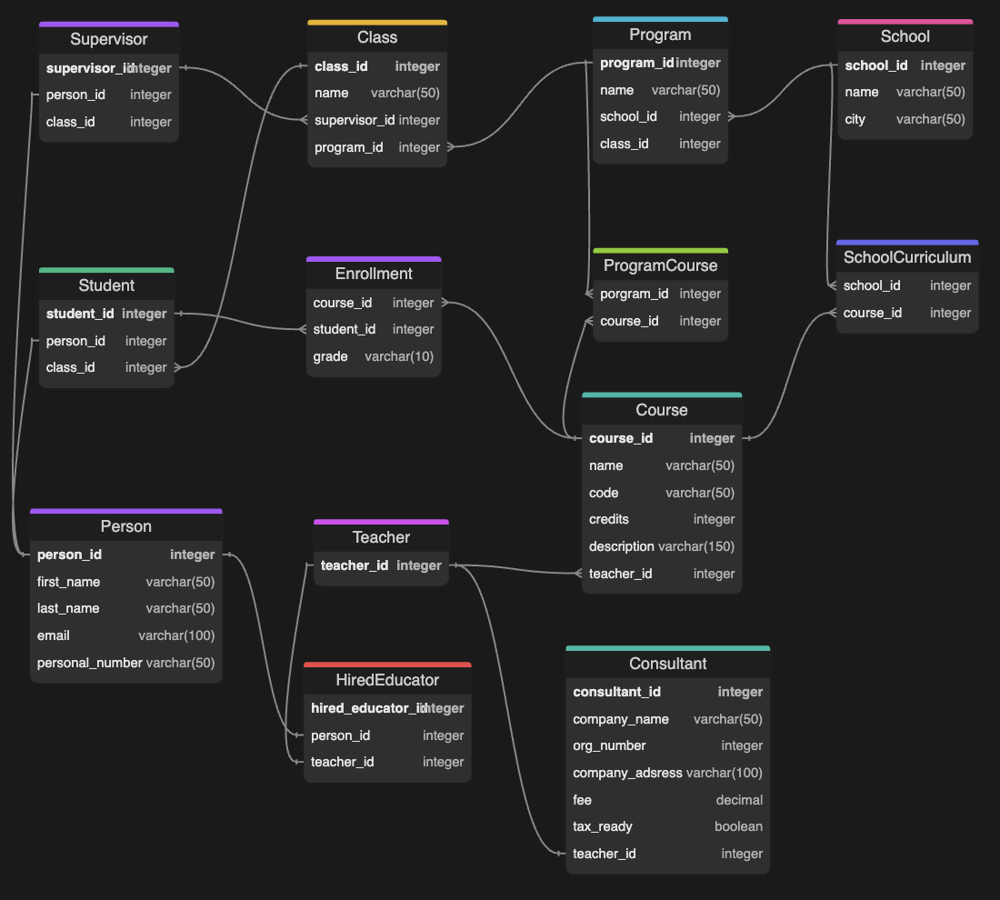

# Build a database for YrkesCo

This document describe 

## Business requirements
- om studenter, förnamn, efternamn, personnummer, email
- utbildare kan vara konsulter
- de planerar att anställa fasta utbildare (BONUS)
- utbildningsledare och deras personuppgifter
- utbildningsledare har hand om 3 klasser
- kurser med namn, kurskod, antal poäng, kort beskrivning av kursen
- program har ett antal kurser knutna till sig
- ett program blir beviljat i tre omgångar, dvs att det finns 3 klasser
- det finns även fristående kurser (BONUS)
- konsulter, deras företag, företagsinfo som organisationsnummer, har F-skatt address, hur mycket de tar i arvode per timma
- YrkesCo har två anläggningar, en i göteborg och en i stockholm, i framtiden kanske de kommer expandera till flera orter (BONUS)

**Additional Business rules**
- A course can have only one teacher
- Standaone course can be taken online by student in any of schools. But courses are only open for students enrolled in the school
- A program belongs to one school
- A course can belong to many programs (Example being a Python fundamentals course)

<br>

> **Note on Personally Identifiable Information (PII)**
>
> Sensititive Personally Identifable Information should be put in its own entities to better control who can get access to the data.


## Conceptual model


## Relationship statements for each entity
- A teacher can have 0 or 1 representation in the Consultant table
- A Consultant can have 1 and only 1 representation in the Teacher table
- A teacher can have 0 or 1 representation in the HiredEducator table
- A HiredEducator can have 1 and only 1 representation in the Teacher table
- A HiredEducator, Student or Supervisor can have 1 and only 1 representation in the Person table
- A Person can have 0 or 1  representation in the HiredEducator, Supervisor and Student table
- A Student can belong to 1 and only 1 Class
- A Class can have many Students
- A Student can be enrolled in many Courses
- A Course can contain many Students
- A Supervisor can have many classes
- A Class can have 1 and only one Supervisor
- A Program can have many Classes
- A Class can have 1 and only 1 Program
- A Course can be in multiple Programs 
- A Program have many Courses
- A Program can be held in 1 and only 1 School
- A School can have many Programs
- A School can have many corses in their Curriculum
- A Course can be part of many school's Curriculums.


## Logical model


## Physical model
[Follow the link](https://github.com/johnsandsjo/data-modelling-john-sandsjo-DE24/blob/main/yh_labb/physical_model.dbml) to see the physical model in Database Markup Language.


## Arguing for normalisation

Normal Form|Requirments|Argument|
|--|--|--|
|**1NF**|✅ all tables have primary key<br>✅ No repeating groups<br> ✅ Uniform column data <br> ✅ Row order does not matter|*Going through each table, all of them has a primary key, the junction tables has it by combining its foreign keys. Each attribute is of one data type and includes no groupings. Row order does matter. Thus, it adhere to first normal form*|
|**2NF**|✅ 1NF<br>✅ Non-prime attributes must be functionally dependendent on entire primary key and not just part of it | *Each table is 1NF. No attributes is functionaly determined by other than the primary key. Thus, 2NF is reached*|
|**3NF**|✅ 2NF<br>✅ Non-prime attributes depends on the key, the whole key and nothing but the key. | *Each table is 2NF. There are no transitive dependencies of the attributes. Thus, 3NF is reached*|

## Creating tables
[See this sql script](https://github.com/johnsandsjo/data-modelling-john-sandsjo-DE24/blob/main/yh_labb/sql/create_tables.psql) on how the tables are being created to ensure refential integrity

## Inserting data
Once the tables are created, it is time to ingest dummy data to test the model. The following method was used to insert data:
- Used Gemini to generate dummy_date in csv's for each Table
- Added the csv's to my local machine
- Added the csv's with "docker cp" into the container tmp folder in Docker

```
Example Class csv:
docker cp dummy_data/Class.csv postgres_data_modeling:/tmp/Class.csv
```

- copied the data from the csv's to the database using the COPY command
```
Example Enrollment csv
COPY Enrollment FROM '/tmp/Class.csv' WITH (FORMAT CSV, HEADER);
```

During the process a iterating by fixing a wrongly defined data type of the course description attribute. I also had some problems with using INTEGER for personal_number which caused me to change to varchar(50), this might cause problem downstream.